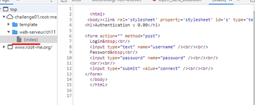
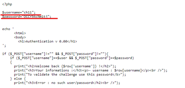

Etape 1 Chercher le fichier de sauvegarde
Après avoir consulté les documentation au sujet des fichier de sauvegarde, j’ai pu constater qu’il était possible de télécharger les fichiers d’un site internet via des lien particulier.
Autrement dit on va devoir extraire le fichier du site internet pour voir son contenu.

Etape 2
Pour cela rien de plus simple nous allons prendre notre site internet et rajouter au lien de la page
« /Index.php » cela nous permet de nous tourner vers le fichier index (donc qui est notre fichier principale dans notre page

 
Ce qui nous donne ce lien ci :
http://challenge01.root-me.org/web-serveur/ch11/index.php
En revanche nous cherchons à extraire les information du fichier index nous allons donc le télécharger en rajoutant simplement « ~ » juste après.
Cela va nous permettre de télécharger l’index et d’observer sans que la page ne convertisse le code php en html et ainsi nous pouvons voir ceci :

 
Ce qui nous permet de trouver le mdp et le nom d’utilisateur
En les rentrant le site internet nous dit d’utiliser le mdp en tant que mot de passe pour Rootme, et voila un autre problème de découvert !

