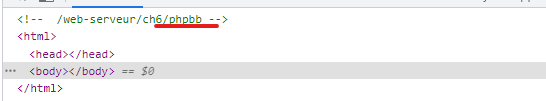
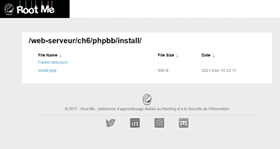
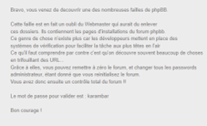

Etape 1 trouver vers ou se diriger
Nous arrivons sur une page blanche dans un premier temps, vu que c’est du php nous allons allez chercher dans le code pour voir s’il n’y a pas un indice.
Et il s’avère que dès la première ligne on peut remarquer quelque chose d’intéressent.

 
Ce lien qui nous amène vers une nouvelle page !
Etape 2 Trouver le fichier d’installation
Maintenant qu’on a trouvé ce lien magique dans le code source, utilisons-le !
Nous allons donc nous rendre sur cette adresse :
http://challenge01.root-me.org/web-serveur/ch6/phpbb/
Ce qui nous amène une nouvelle fois sur un lien d’une page encore vierge …
Mais, nous avançons ! Vu que cette fois ci le logo RootMe nous indique que nous somme sur la bonne voie !
Il va nous falloir chercher un fichier d’installation dans le phpbb de la page internet
Pour ça on peut simplement rajouter /install a la fin de notre lien.
Cela nous permet de nous rediriger vers le lien d’installation du phpbb
http://challenge01.root-me.org/web-serveur/ch6/phpbb/install/

 
Et enfin il ne nous reste plus qu’a cliquer sur le « install.php » et Hop ! Le mot de passe à rentrer sur root me !

